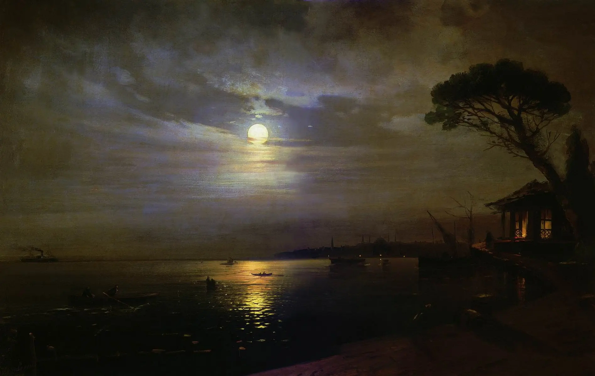

# Image Utility Imperium

## PROJECT INCOMPLETE, Not in use; currently being developed



## Every Image Manipulation operation I need in one place

### Usually these are done on slow websites with ads, watermarks, premium versions, etc

Made this so I don't need online converters.
The utilities in this project are mainly used for cleaning up images for projects and other designable things

## Currently Implemented

### Background Remover

    Get rid of backgrounds from images

### Image Compressor

    Reduce the resolution of images while maintaing similar quality and keeping the same "contents"

### Perspective Fixer

    Used to straigthen out images that are taken at an angle. Creates professional look.

To run this project, you need to have Python 3.0 or higher and Flask installed. Also VSCode or any other IDE that supports python. After cloning the repository, you need to download the required packages.

To download the required packages, type:
    ```python
        pip install -r requirements.txt
    ```
This will install all required packages. And they will be available system-wide.

Type
    ```
        flask run
    ```
 runserver in the terminal to start the server (will open a tab in your browser ( ctrl+click the link that shows up in terminal http://127.0.0.1:5000/)).
