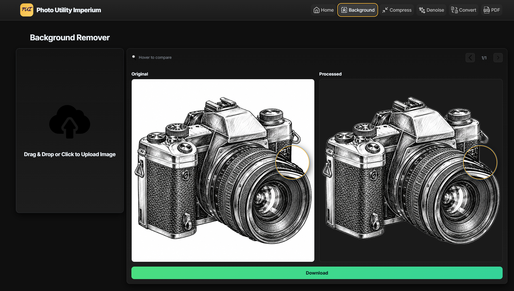
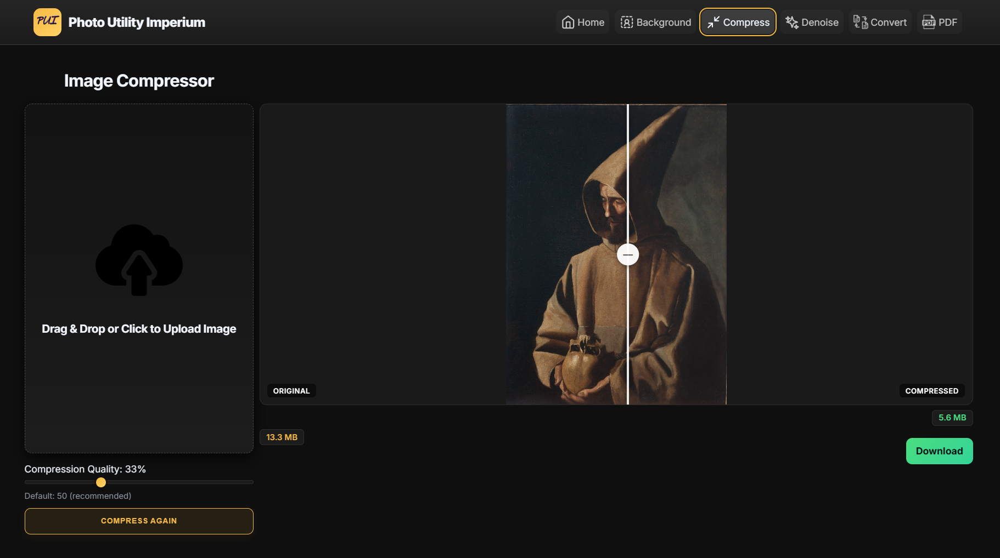
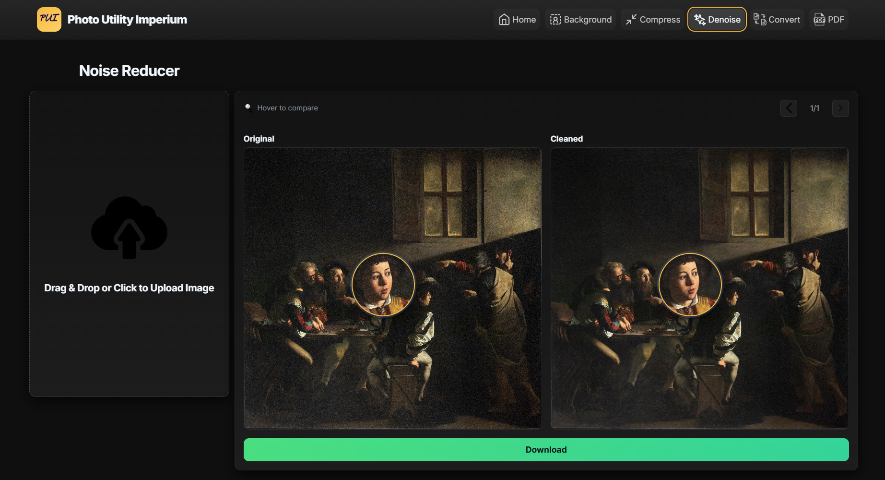
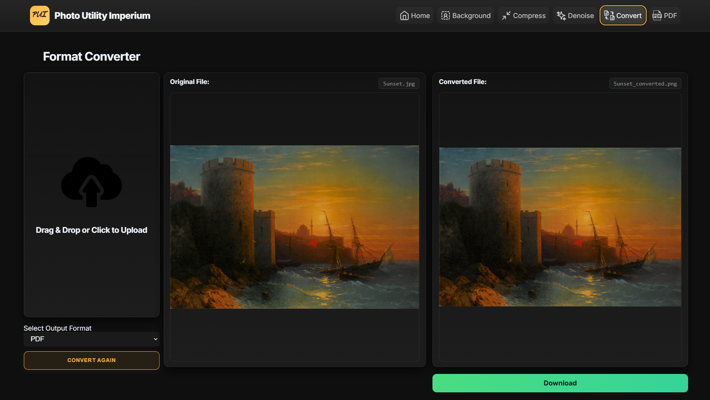
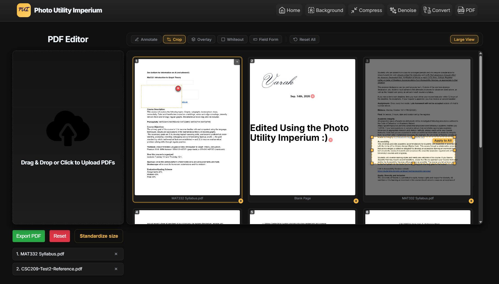

# Photo Utility Imperium


## Every Image Manipulation Operation in One Place

### Why use this?

When working with images, there's usually a long set of things that one needs to do. For eample, removing backgrounds, converting to PDFs, and merging those PDFs. These functionalites are often found in online websites which are slow, ad-ridden, watermarked, and rate-limited.

This project provides a solution for performing these operations offline and efficiently, with no restrictions. You get all of the upsides of having access to the processing, without the hassles that come with online tools, and an extra added layer of complete privacy.

The implemented methods are faster, more efficient, and accessible. The UI is simple for your (and my) usage convenience. Many of the models, like those from opencv, can definetely be tuned and improved for better results but, for most use cases, what we have now is sufficient.

## Features

### Background Removal



Input an image in any format, and get back a PNG with the background removed.

### Image Compressor



Reduce file size by getting rid of redundant data in the image.

Note: for "compression", it's often advisable to convert to `webp` instead of using this tool, as it's an inherently efficient format.

### Noise Reducer



Get rid of image noise to make the subjects appear more defined.

Note: do not use this on documents as this tends to blur the text.

### File Format Converter



Convert an image file to any format you need (PDF, PNG, JPEG, etc.). 

### PDF Merger



Merge PDFs and add pages between them.
  
## Prerequisites

To run this project locally, you need to have:

- Python 3.10 or higher
- Microsoft Visual C++ Redistributable (for Windows users)

### Installation

1. **Clone the repository**  
   Download the repository to your local machine using `git clone` or a direct download.

2. **Install dependencies**  
   After cloning, open a terminal and navigate to the project directory.

   Using conda:

   ```bash
   conda create -n pui python=3.10
   conda activate pui
   pip install -r requirements.txt
   ```

   Using pip:

   ```bash
   python -m venv pui_env
   source pui_env/bin/activate  # For MacOS/Linux
   pui_env\Scripts\activate     # For Windows
   pip install -r requirements.txt
   ```

#### Run the Application

Make sure the virtual environment is activated (or at least the dependencies are installed). Navigate to the directory containing `app.py`.

Then, run:

```bash
python app.py
```

This will start a local server. Note that, when running locally for the first time, it will take a while to load.

Visit [http://127.0.0.1:5000/](http://127.0.0.1:5000/) to open the application in your browser.

### Deactivating the Environment

For conda:

```bash
conda deactivate
```

For pip:

```bash
deactivate
```
